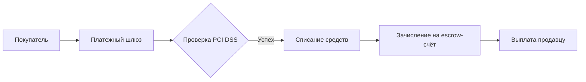

# market_backend

### Технологии
- python3.12
- FASTAPI 
- poetry 
- Ruff 
### Используемые API


### Задача
### Ключевые фичи проекта, реализуемые бэкендом

---

#### 1. **Аутентификация и безопасность**
- **Многофакторная аутентификация**  
  Подтверждение email/телефона, OAuth2 для соцсетей
- **RBAC (ролевая модель)**  
  Управление правами администраторов (суперадмин, модератор, аналитик)
- **Защита данных**  
  Хеширование паролей (bcrypt), SSL/TLS, валидация против XSS/SQL-инъекций
- **Сессионное управление**  
  JWT-токены, автоматический вход для доверенных устройств

---

#### 2. **Управление пользователями**
- **Регистрация/верификация**  
  Валидация документов продавцов через API ФНС
- **Блокировка/разблокировка**  
  Система модерации с историей нарушений
- **Профили**  
  Единый профиль для мультиролей (покупатель/продавец)

---

#### 3. **Товары и каталог**
- **CRUD для товаров**  
  Генерация штрих-кодов (python-barcode)
- **Динамические категории**  
  Древовидная структура с неограниченной вложенностью
- **Модерация контента**  
  Автоматическая проверка изображений (CV)

---

#### 4. **Транзакции и платежи**

- **Интеграция с PSP**  
  Stripe, CloudPayments, Сбербанк API
- **Выплаты продавцам**  
  Автоматические/ручные переводы
- **Система возвратов**  
  Автоматическая отмена заказов

---

#### 5. **Заказы и логистика**
- **Real-time трекинг**  
  Интеграция с API СДЭК/Boxberry
- **Уведомления**  
  WebSocket/Push для статусов заказов
- **Расчёт ETA**  
  Прогнозирование времени доставки

---

#### 6. **Аналитика и отчёты**
| Тип отчёта         | Частота     | Технологии         |
|--------------------|-------------|--------------------|
| Анализ продаж      | Реал-тайм   | ClickHouse         |
| Трафик             | Ежедневно   | Google Analytics   |
| Эффективность акций| Еженедельно | Python ML          |

---

#### 7. **Маркетинговые инструменты**
- **Гибкие скидки**
- **Таргетирование баннеров**  
  Сегментация по поведению пользователей
- **Автоуведомления**  
  Оповещение продавцов об акциях

---

#### 8. **Коммуникации**
- **In-app чат**  
  Архитектура:
  ```
  Клиент → WebSocket → Redis Pub/Sub → Celery → БД
  ```
- **Тикеты поддержки**  
  Система приоритетов (Critical/High/Medium/Low)

---

#### 9. **Системные фичи**
- **Elasticsearch**  
  Полнотекстовый поиск с фильтрами
- **Кэширование**  
  Redis для каталога товаров
- **Асинхронные задачи**  
  Celery для:
  - Генерации отчётов
  - Обработки изображений
  - Массовых уведомлений

---

### Архитектурные решения
```plaintext
┌─────────────────┐       ┌────────────────┐       ┌───────────────┐
│   Клиенты       │──────▶│   Nginx        │──────▶│   FastAPI     │
│   (Web/Mobile)  │◀──────│   (fIREwALL)   │◀──────│   Monolith    │
└─────────────────┘       └────────────────┘       └───────┬───────┘
                                                           │
                                                           ▼
┌───────────────────────────────────────────────────────┐
│                   Уровень данных                      │
│  ┌──────────┐    ┌─────────┐    ┌─────────────────┐   │
│  │PostgreSQL│    │ Redis   │    │ MinIO/S3        │   │
│  └──────────┘    └─────────┘    └─────────────────┘   │
└───────────────────────────────────────────────────────┘
```

### Безопасность (дополнительно)
- **Rate Limiting**  
  `100 запросов/мин с IP`
- **CSP Headers**  
  Запрет исполнения inline-скриптов
- **Аудит действий**  
  Логирование операций:
  ```json
  {
    "action": "block_user",
    "target": "seller_12345",
    "executor": "admin_007",
    "timestamp": "2023-11-20T14:23:43Z"
  }
  ```

### Запуск проекта
- git clone {project url}
#### быстрый старт докер
  + #####  sudo cmod +x start_test.sh 
  + #####  ./start_test.sh запустит скрит докер компосе по завершению очистит
- * ###### http://127.0.0.1:8080/ping проверка
#### для разработчиков
  + #####  poetry env use python3.12 создаст виртуальное окружение
  + #####  poetry install
## Холодный старт
- poetry init -n --python "^3.12"
- poetry config virtualenvs.in-project true
- poetry env use python3.12 создаст виртуальное окружение
- mkdir src
- poetry install --no-root

## Установка требует
  * python3.12
    * poetry
        * ##### Linux/macOS
        - *      curl -sSL https://install.python-poetry.org | python3 -
        * ##### Windows (PowerShell)
        - *     (Invoke-WebRequest -Uri https://install.python-poetry.org -UseBasicParsing).Content | py -
        * ### Oсновные команды poetry
          #### Активировать окружение
          - poetry shell
          #### Добавить новую зависимость
          - poetry add package-name
          #### Обновить зависимости
          - poetry update
          #### Запустить приложение
          - poetry run python src/main.py 
          #### Проверить и исправить код
          -  poetry run ruff check . --fix
